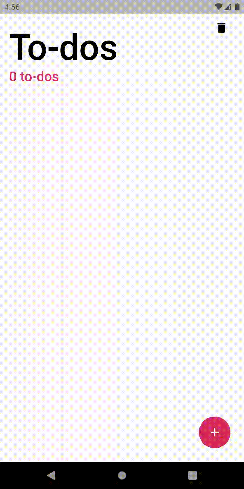

# flutter_state_management_samples

## About
The **Flutter State Management Samples** project demonstrates the main principles of implementing common state management strategies. 

This project implements the tasks app using different approaches for state management (changes are only applied for presentation layer). Tasks are stored locally using [hive](https://pub.dev/packages/hive), dependency injection is implemented with help of [get_it](https://pub.dev/packages/get_it). 

App demo:

## Currently implemented:
* Cubit (using [flutter_bloc](https://pub.dev/packages/flutter_bloc))
* Bloc (using [flutter_bloc](https://pub.dev/packages/flutter_bloc))
* GetX (using [get](https://pub.dev/packages/get))
* Redux (using [redux](https://pub.dev/packages/redux) and [flutter_redux](https://pub.dev/packages/flutter_redux))
* Provider (using [provider](https://pub.dev/packages/provider))
